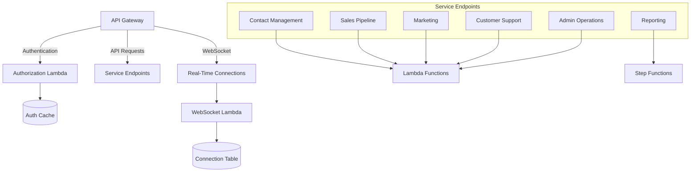
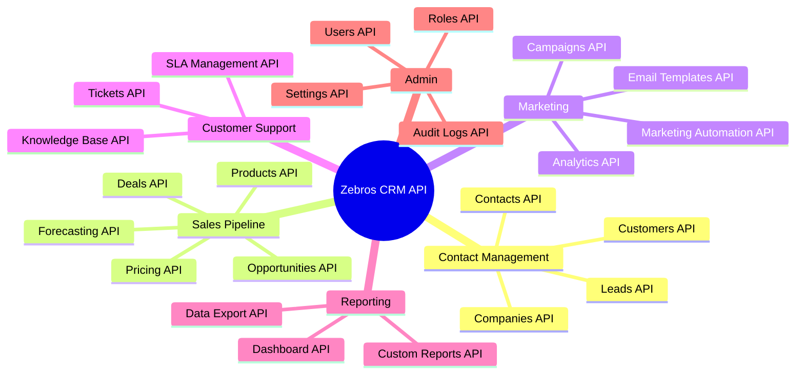
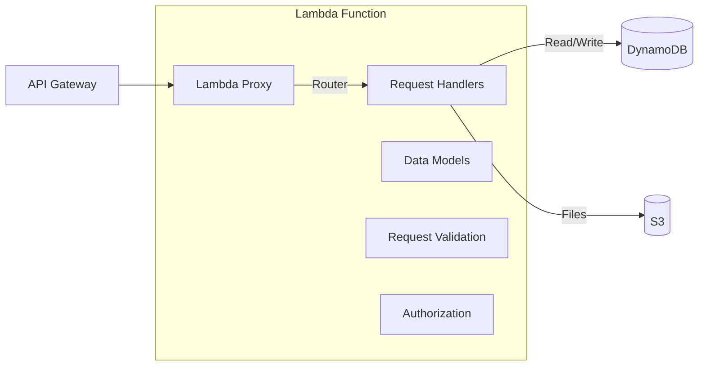
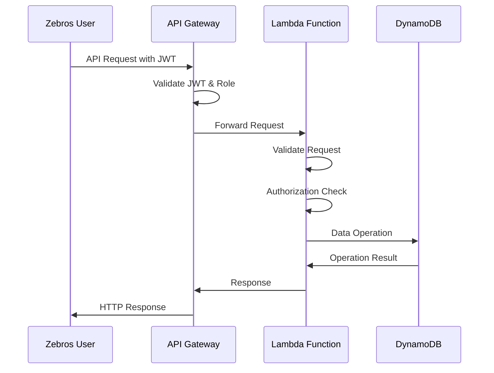
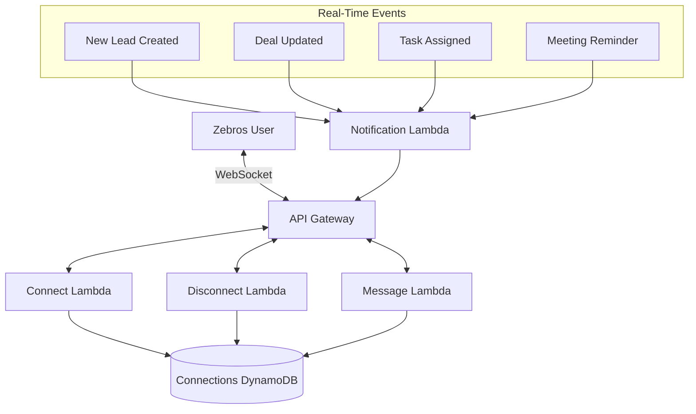
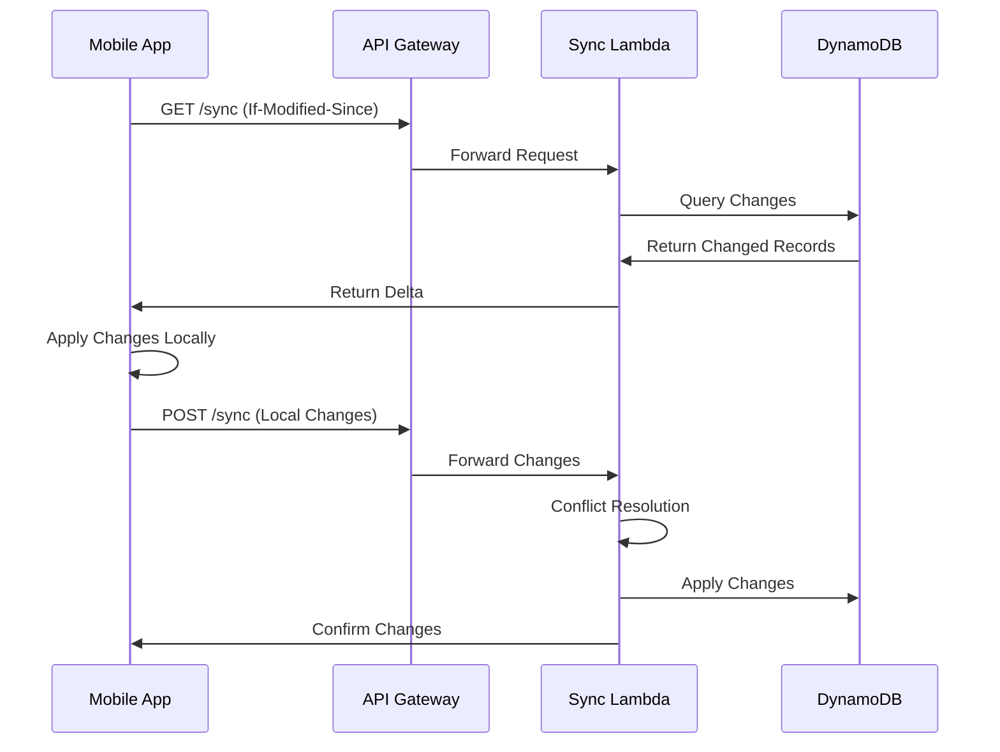
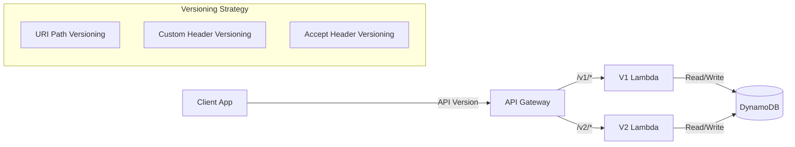

# Zebros CRM API Services Architecture

This document outlines the API service architecture for the Zebros CRM system.

## API Gateway Structure



## API Domain Structure

The Zebros CRM API is organized into several domains:



## Implementation Details

### Lambda-based APIs

Standard CRM operations are implemented using Lambda functions with the following structure:



### API Request Flow



## CRM-Specific API Endpoints

### Customer Management

```mermaid
flowchart TD
    Customers[/customers] --> List[GET /customers]
    Customers --> Create[POST /customers]
    Customers --> GetById[GET /customers/{id}]
    Customers --> Update[PUT /customers/{id}]
    Customers --> Delete[DELETE /customers/{id}]
    Customers --> Notes[/customers/{id}/notes]
    Customers --> Activities[/customers/{id}/activities]
    Customers --> Deals[/customers/{id}/deals]
    
    subgraph "Data Model"
        CustomerModel[Customer Model]
        CustomerModel --> BasicInfo[Basic Information]
        CustomerModel --> ContactInfo[Contact Information]
        CustomerModel --> Classification[Classification & Tags]
        CustomerModel --> Relationships[Relationships]
        CustomerModel --> CustomFields[Custom Fields]
    end
```

### Sales Pipeline

```mermaid
flowchart TD
    Opportunities[/opportunities] --> List[GET /opportunities]
    Opportunities --> Create[POST /opportunities]
    Opportunities --> GetById[GET /opportunities/{id}]
    Opportunities --> Update[PUT /opportunities/{id}]
    Opportunities --> Stage[PUT /opportunities/{id}/stage]
    Opportunities --> Delete[DELETE /opportunities/{id}]
    
    subgraph "Pipeline Stages"
        StageModel[Stage Progression]
        StageModel --> Lead[Lead]
        StageModel --> Qualified[Qualified]
        StageModel --> Proposal[Proposal]
        StageModel --> Negotiation[Negotiation]
        StageModel --> Closed[Closed Won/Lost]
    end
```

## WebSocket Support

For real-time updates to CRM users, the architecture includes WebSocket support:



## API Gateway Configuration

- Custom domain with TLS (api.zebroscrm.com)
- API key for rate limiting and usage plans
- Throttling configurations to prevent overload
- Request validation using JSON Schema models
- CORS configuration for web clients
- WebSocket API for real-time updates

## Data Synchronization

For mobile app offline functionality:



## API Versioning



## Monitoring and Logging

- CloudWatch Logs for all API requests with structured logging
- X-Ray for distributed tracing across components
- Custom metrics for business-level monitoring:
  - Leads created per day
  - Opportunities by stage
  - Conversion rates
  - API response times by endpoint

## Initial Sizing and Scaling

- Lambda functions: 128MB RAM, 3 second timeout for standard APIs
- Lambda functions: 1GB RAM, 15 second timeout for data processing APIs
- API Gateway: Default throttling with burst capacity configured
- DynamoDB: On-demand capacity for initial deployment
- Connection handling: Up to 500 concurrent WebSocket connections