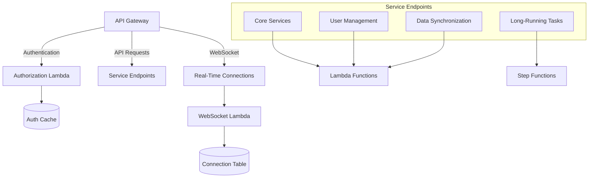
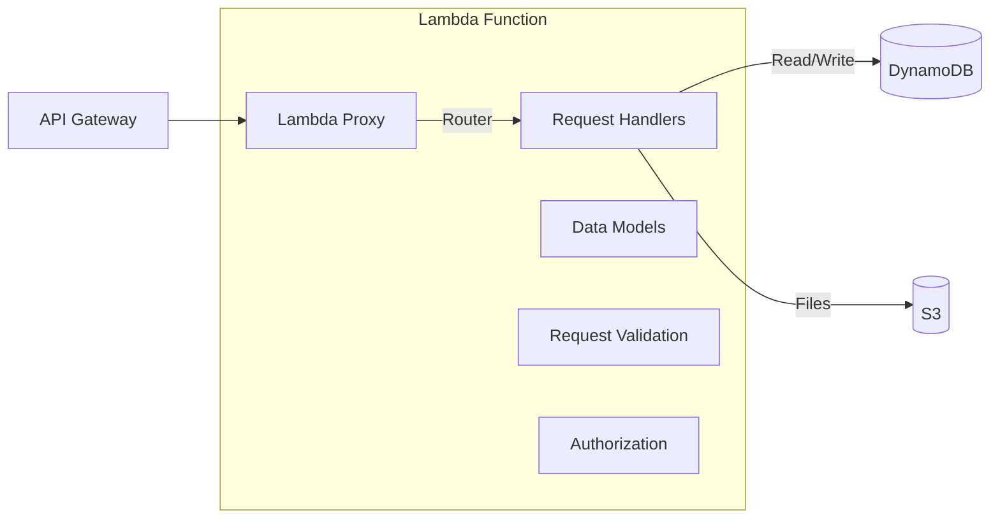
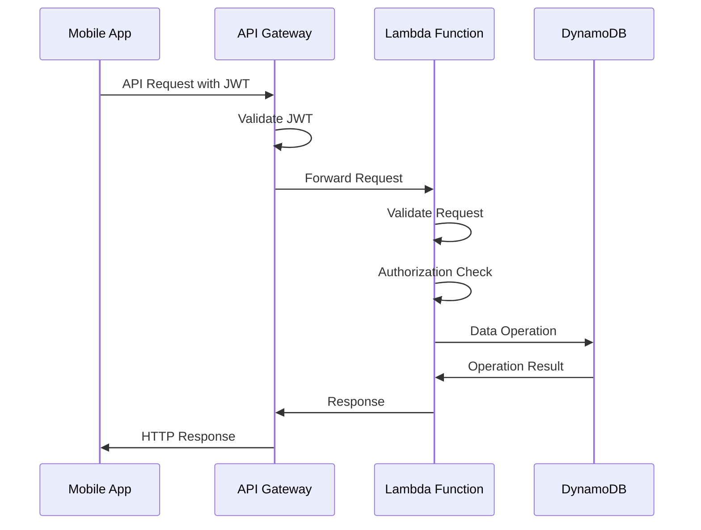
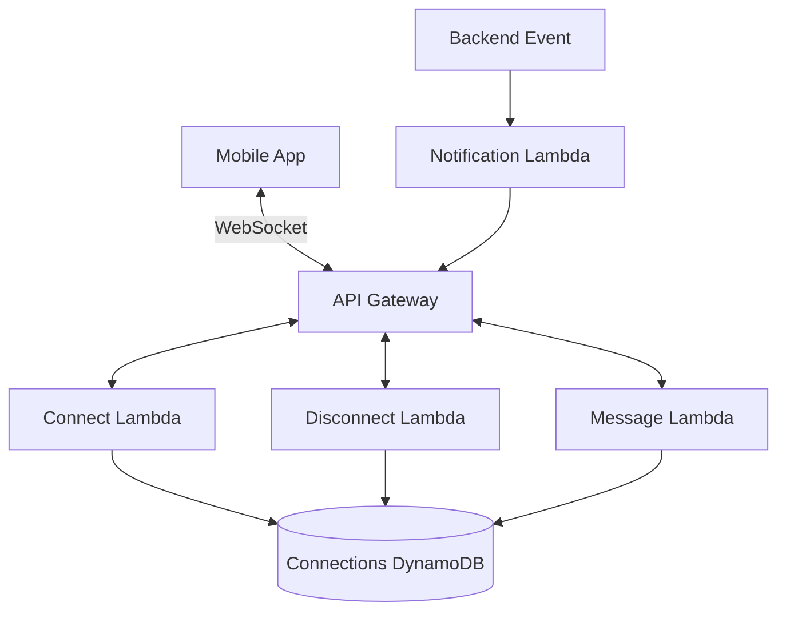

# API Services Architecture

This document outlines the API service architecture for the serverless application.

## API Gateway Structure

## API Structure

The API is organized into several domains:

1. **Core Services** - Essential application functionality
2. **User Management** - User-specific operations
3. **Data Synchronization** - Mobile app data sync APIs
4. **Long-Running Tasks** - APIs that initiate background tasks

## Implementation Details

### Lambda-based APIs

Standard REST APIs are implemented using Lambda functions with the following structure:

### API Request Flow

## WebSocket Support

For real-time updates to mobile clients, the architecture includes WebSocket support:

## API Gateway Configuration

- Custom domain with TLS
- API key for rate limiting
- Throttling configurations
- Request validation using models
- CORS configuration for web clients

## Monitoring and Logging

- CloudWatch Logs for all requests
- X-Ray for distributed tracing
- Custom metrics for business-level monitoring

## Initial Sizing and Scaling

- Lambda functions: 128MB RAM, 3 second timeout for standard APIs
- Lambda functions: 1GB RAM, 15 second timeout for data processing APIs
- API Gateway: 10,000 requests/second burst capacity
- DynamoDB: On-demand capacity for initial deployment