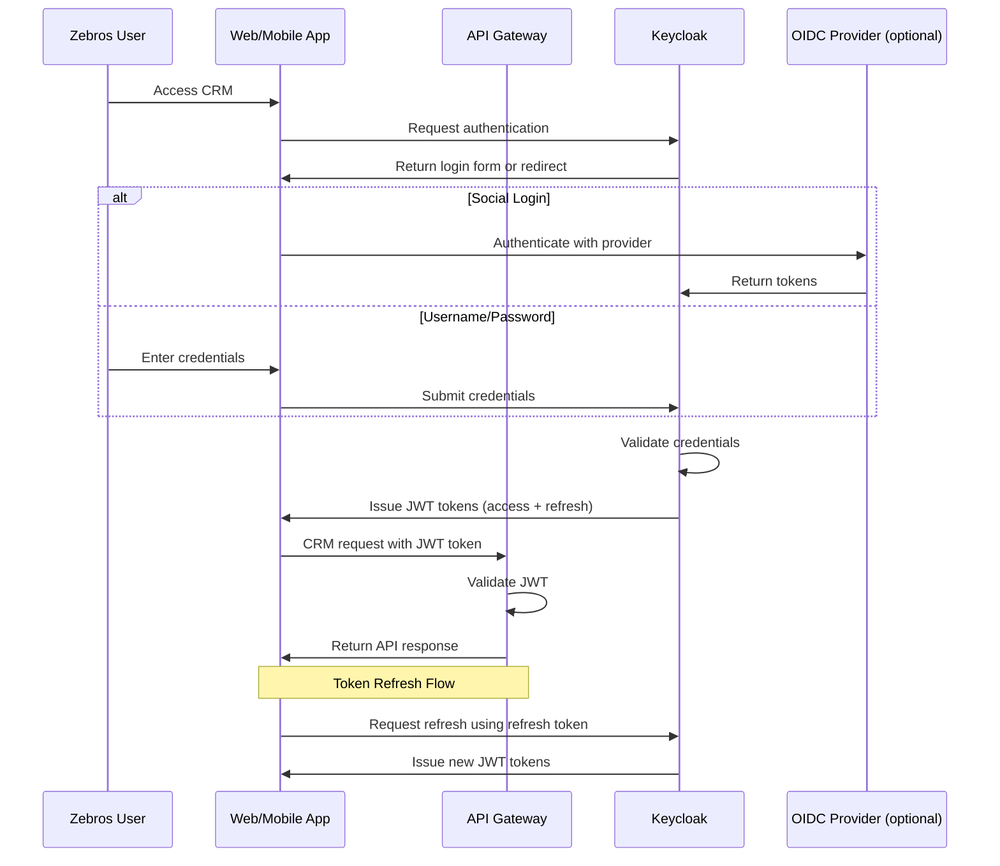
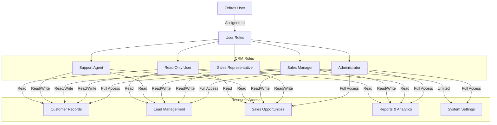
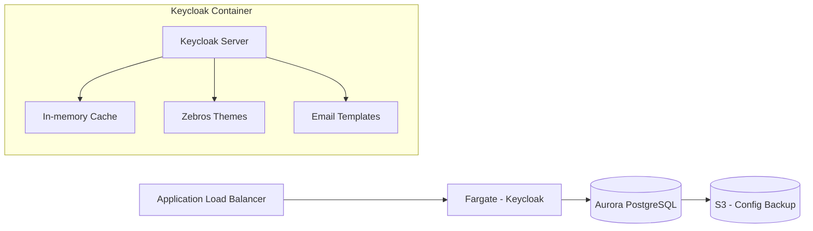
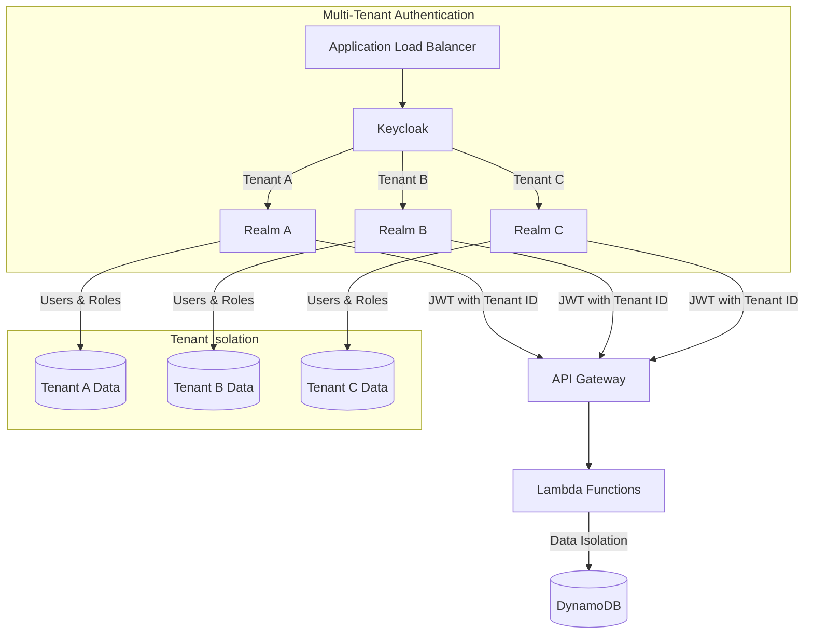

# Zebros CRM Authentication Architecture

This document describes the authentication flow for the Zebros CRM system using Keycloak in a serverless environment.

## Authentication Flow

## Role-Based Access Control

## Keycloak in Serverless Mode

Keycloak is deployed as a containerized application running on AWS Fargate, allowing for serverless operation.

## Key Components

1. **Keycloak Container**:
   - Runs in Fargate for serverless operation
   - Configured for auto-scaling based on demand
   - Optimized for low-memory footprint
   - Customized with Zebros branding

2. **Database**:
   - Aurora Serverless PostgreSQL for user data
   - Auto-scales based on demand
   - Automated backups
   - Encrypted at rest

3. **JWT Validation**:
   - API Gateway validates JWT tokens
   - Public key caching for performance
   - Role-based claims for authorization

4. **Single Sign-On**:
   - Web and mobile app use the same authentication
   - Optional integration with corporate identity providers
   - Support for SAML and OIDC protocols

## Implementation Considerations

- **Cold Start Time**: Minimize by using provisioned concurrency
- **Session Management**: Use client-side session storage when possible
- **Token Lifecycle**: 
  - Short-lived access tokens (1 hour)
  - Longer refresh tokens (7 days) with rotation
- **User Provisioning**: 
  - Self-registration with admin approval workflow
  - Bulk user import for onboarding teams
  - User sync with external systems (optional)

## Multi-Tenant Considerations

For Zebros CRM multi-tenant deployment:

## Scaling Considerations

- Initial deployment with minimal resources (1 Fargate task)
- Auto-scaling policy based on CPU/memory utilization
- Ability to add read replicas for the database as user count grows
- Caching strategy for frequently accessed authentication data