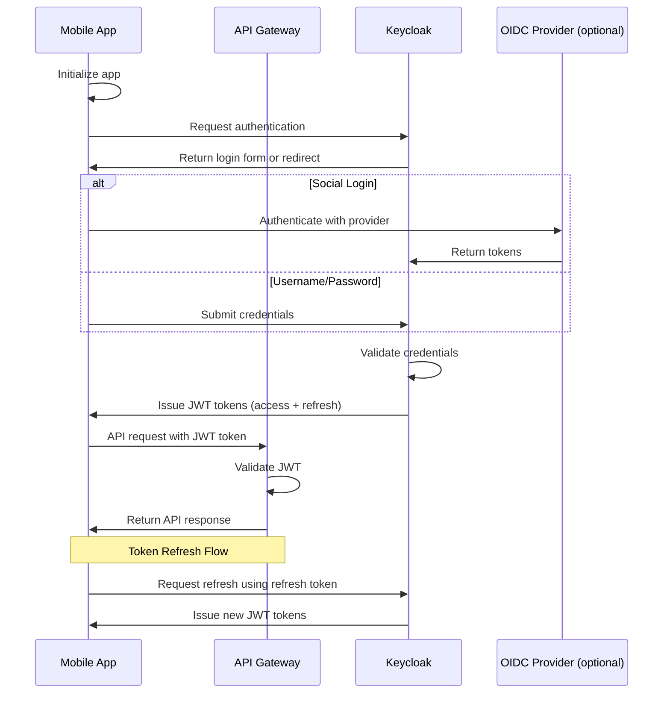
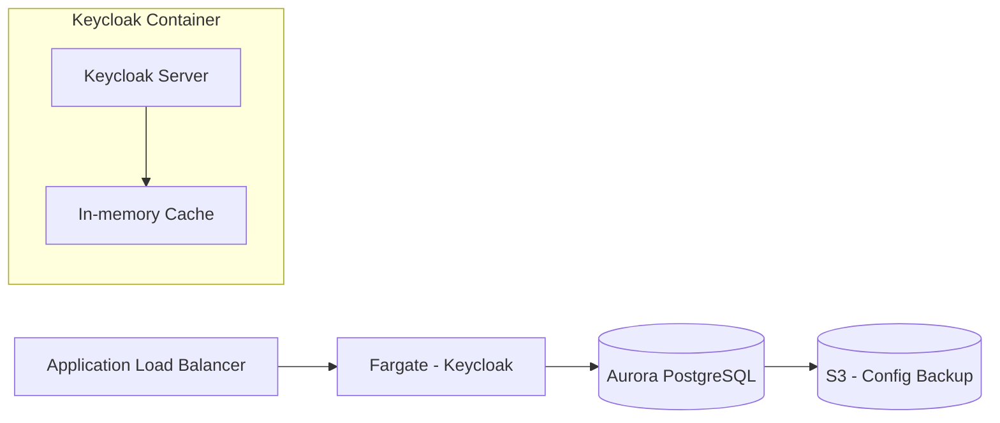

# Authentication Architecture

This document describes the authentication flow for the mobile application using Keycloak in a serverless environment.

## Authentication Flow

## Keycloak in Serverless Mode

Keycloak is deployed as a containerized application running on AWS Fargate, allowing for serverless operation.

## Key Components

1. **Keycloak Container**:
   - Runs in Fargate for serverless operation
   - Configured for auto-scaling based on demand
   - Optimized for low-memory footprint

2. **Database**:
   - Aurora Serverless PostgreSQL for user data
   - Auto-scales based on demand
   - Automated backups

3. **JWT Validation**:
   - API Gateway validates JWT tokens
   - Public key caching for performance

## Implementation Considerations

- **Cold Start Time**: Minimize by using provisioned concurrency
- **Session Management**: Use client-side session storage when possible
- **Token Lifecycle**: 
  - Short-lived access tokens (1 hour)
  - Longer refresh tokens (7 days) with rotation
- **User Provisioning**: 
  - Self-registration flows with email verification
  - Admin API for batch user creation

## Scaling Considerations

- Initial deployment with minimal resources (1 Fargate task)
- Auto-scaling policy based on CPU/memory utilization
- Ability to add read replicas for the database as user count grows