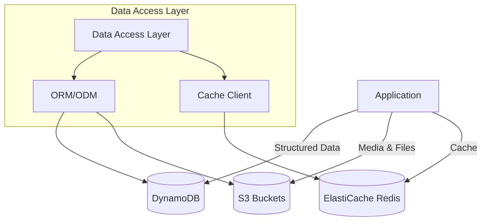
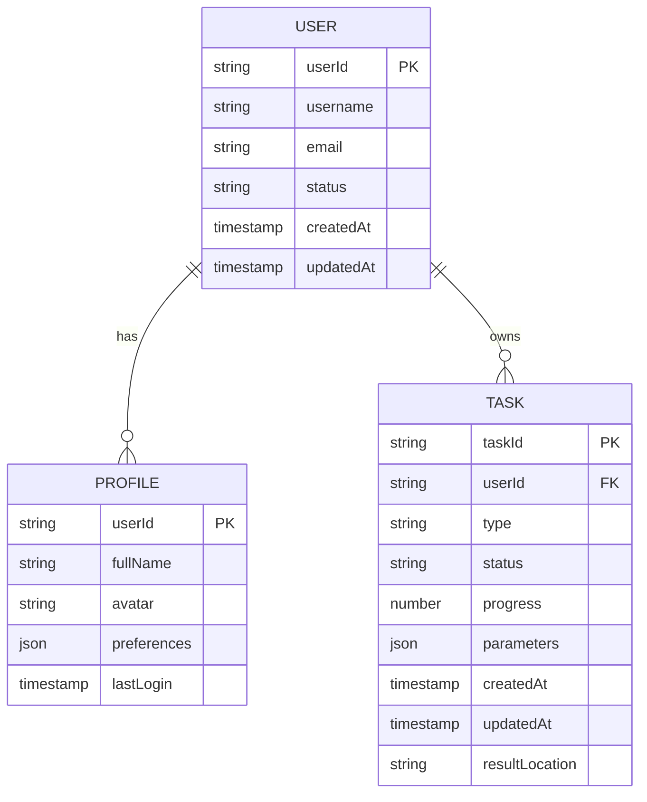
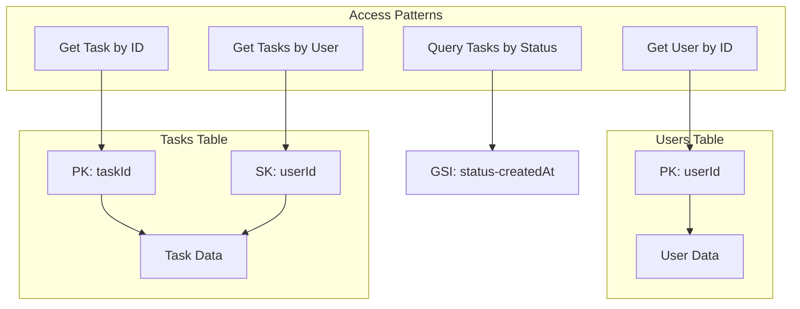
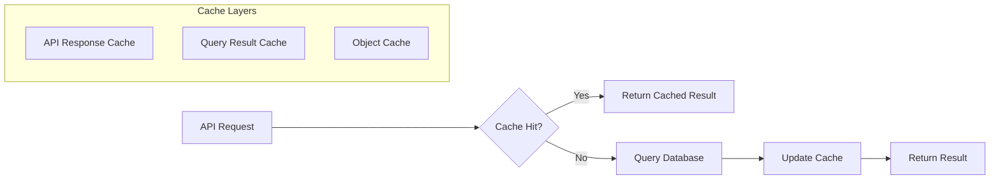
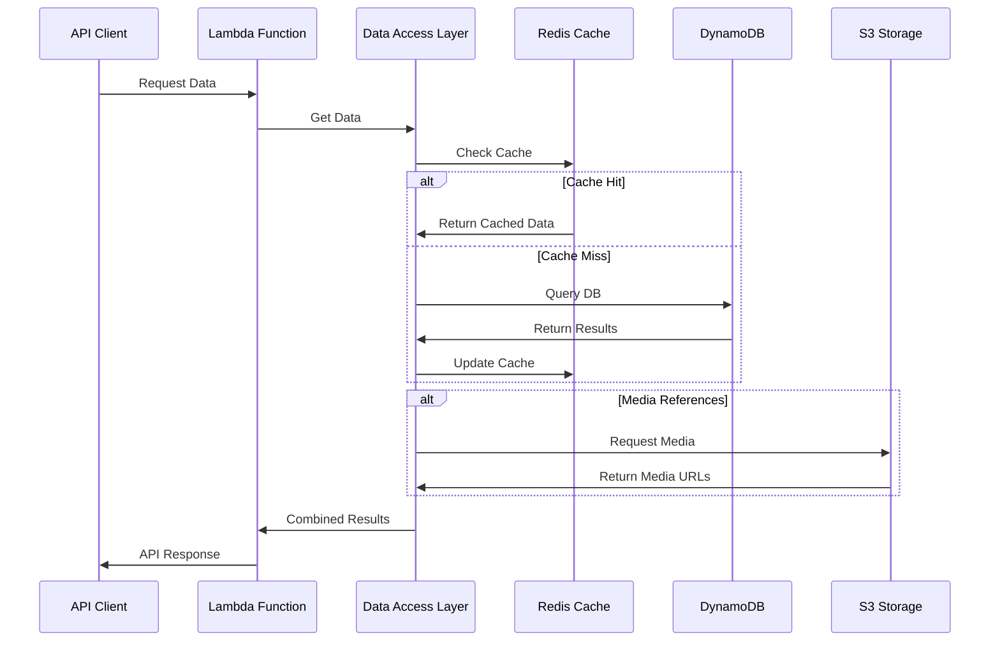

# Data Storage Architecture

This document outlines the data storage architecture for the serverless application.

## Overview

The architecture uses a multi-tiered storage approach, with different storage solutions optimized for different data patterns.



## Data Models

### Core Data Models



## Storage Implementation

### DynamoDB Tables

Primary structured data storage with the following table design:



### S3 Storage Design

Object storage organized into purpose-specific buckets:

```mermaid
flowchart TD
    subgraph "S3 Storage"
        UserData[User Data]
        TaskData[Task Data]
        SharedData[Shared Resources]
        Backups[System Backups]
    end
    
    UserData --> |Organization| UserPrefix[/users/{userId}/]
    TaskData --> |Organization| TaskPrefix[/tasks/{taskId}/]
    
    subgraph "Lifecycle Policies"
        Hot[Hot Storage: Standard]
        Warm[Warm Storage: IA]
        Cold[Cold Storage: Glacier]
    end
    
    UserData --> Hot
    TaskData --> Hot
    TaskData --> |After 30 days| Warm
    TaskData --> |After 90 days| Cold
```

### Caching Strategy



## Data Access Patterns

### Read/Write Flow



## Initial Sizing and Scaling

- **DynamoDB**:
  - On-demand capacity mode initially
  - Transition to provisioned capacity with autoscaling when patterns emerge
  - Item size limit consideration: Keep items under 1KB when possible

- **S3**:
  - Initial buckets sized for 50GB
  - Multi-part upload configuration for large files
  - Intelligent tiering for cost optimization

- **ElastiCache**:
  - Start with t3.micro node (0.5GB)
  - Scale vertically to larger node types as needed
  - Add cluster nodes horizontally for higher throughput