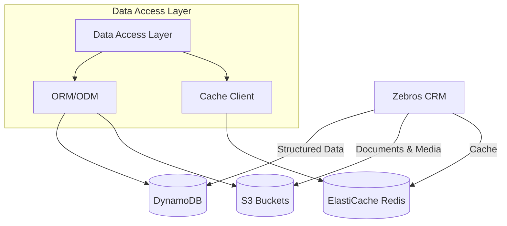
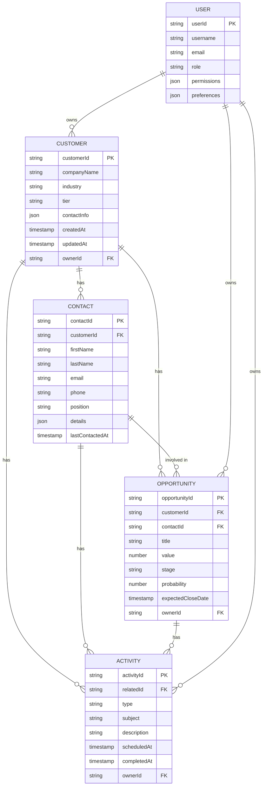
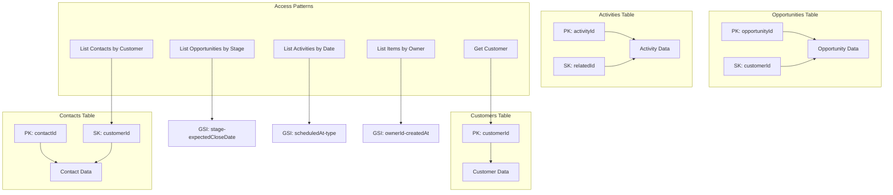
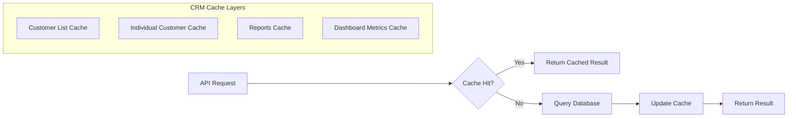
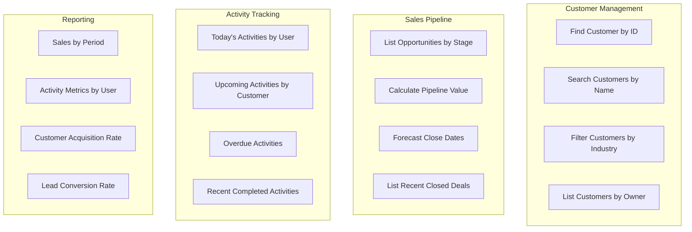
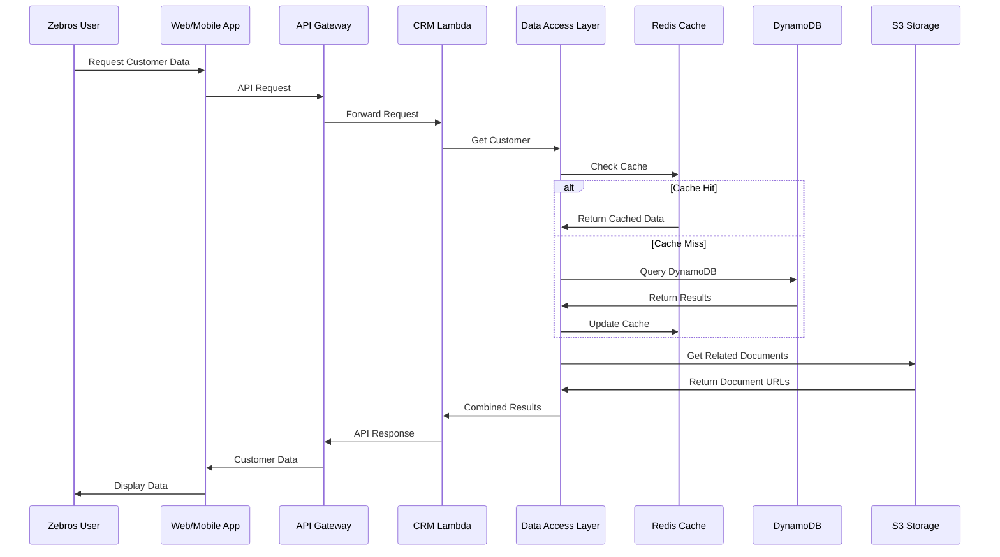
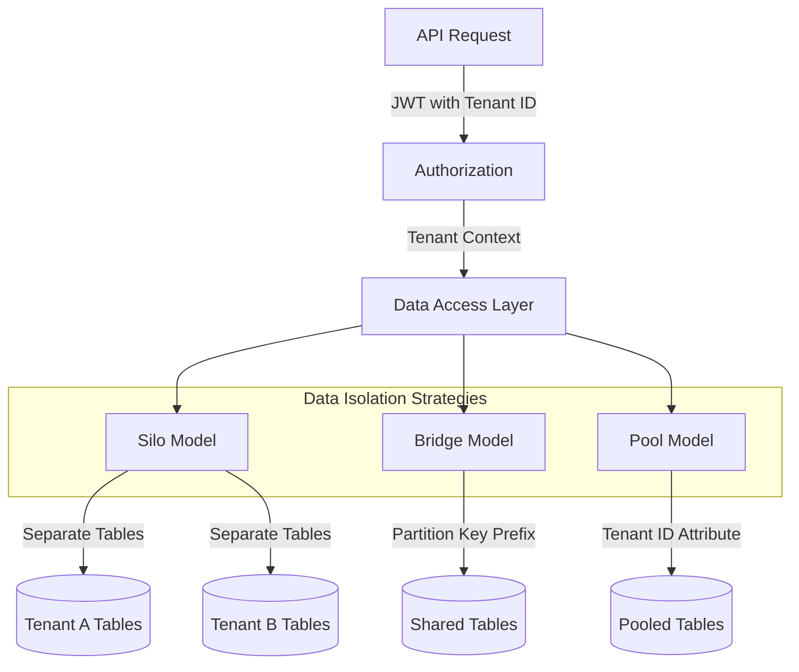
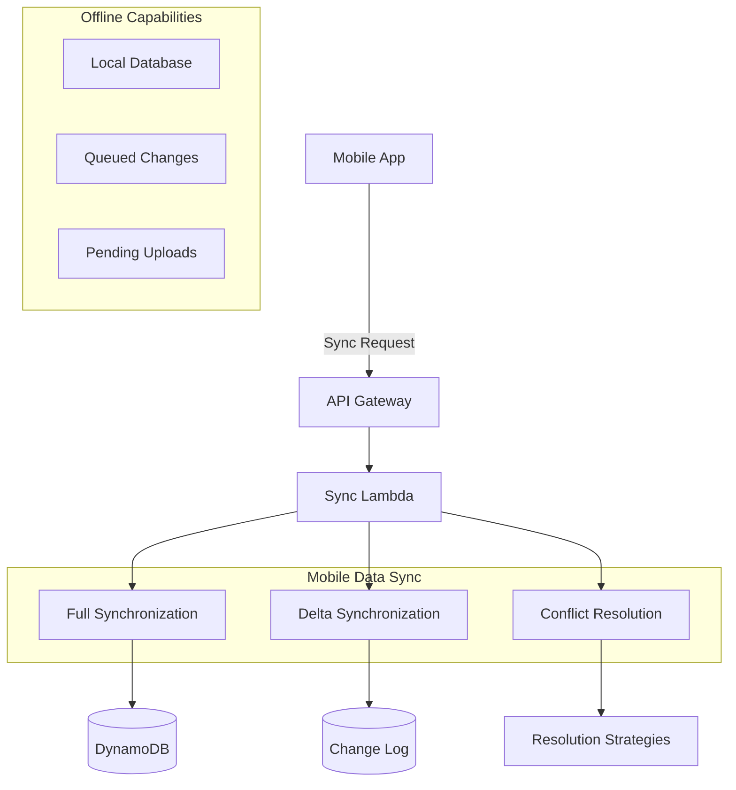
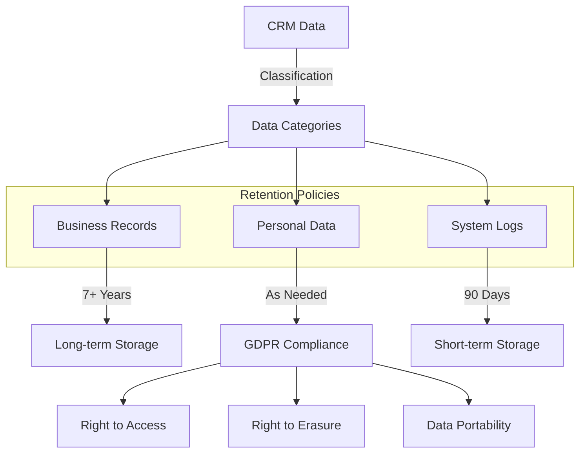

# Zebros CRM Data Storage Architecture

This document outlines the data storage architecture for the Zebros CRM system.

## Overview

The architecture uses a multi-tiered storage approach, with different storage solutions optimized for different data patterns.



## CRM Data Models



## Storage Implementation

### DynamoDB Tables

Primary structured data storage with the following table design:



### S3 Storage Design

Object storage organized into purpose-specific buckets:

```mermaid
flowchart TD
    subgraph "S3 Storage"
        Documents[Customer Documents]
        Attachments[Email Attachments]
        ImportExport[Import/Export Files]
        Reports[Generated Reports]
        Templates[Email Templates]
        Backups[System Backups]
    end
    
    Documents --> |Organization| DocPrefix[/customers/{customerId}/documents/]
    Attachments --> |Organization| AttPrefix[/customers/{customerId}/attachments/]
    ImportExport --> |Organization| ImpPrefix[/imports/{importId}/]
    Reports --> |Organization| RepPrefix[/reports/{reportId}/]
    
    subgraph "Lifecycle Policies"
        Hot[Hot Storage: Standard]
        Warm[Warm Storage: IA]
        Cold[Cold Storage: Glacier]
    end
    
    Documents --> Hot
    Attachments --> Hot
    ImportExport --> |After 30 days| Warm
    Reports --> |After 60 days| Warm
    Reports --> |After 1 year| Cold
```

### Caching Strategy



## CRM-Specific Data Access Patterns

### Common CRM Queries



### Read/Write Flow



## Multi-Tenant Data Isolation



## Data Synchronization for Mobile



## Initial Sizing and Scaling

- **DynamoDB**:
  - On-demand capacity mode initially
  - Transition to provisioned capacity with autoscaling when patterns emerge
  - Item size optimization: Keep items under 1KB for core entities

- **S3**:
  - Separate buckets for documents, reports, templates, and backups
  - Multi-part upload configuration for large file attachments
  - Intelligent tiering for cost optimization

- **ElastiCache**:
  - Start with t3.micro node (0.5GB)
  - Scale vertically to larger node types as user base grows
  - Add cluster nodes horizontally for higher throughput

## Data Retention and Compliance

