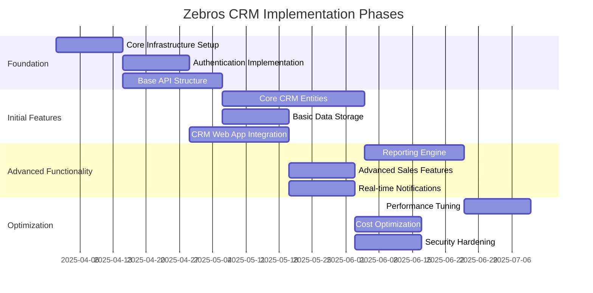
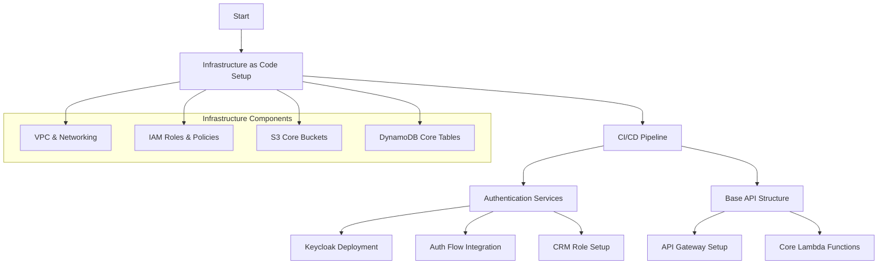
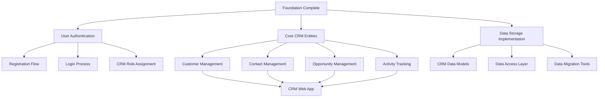
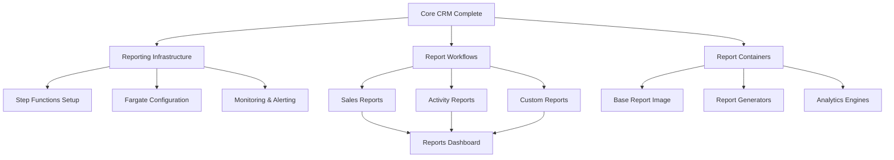
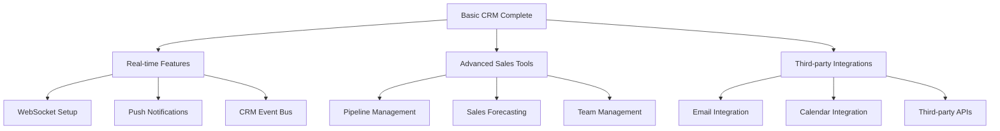
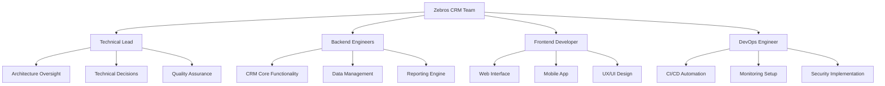
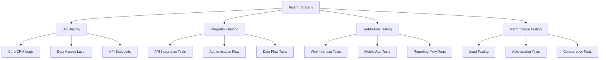
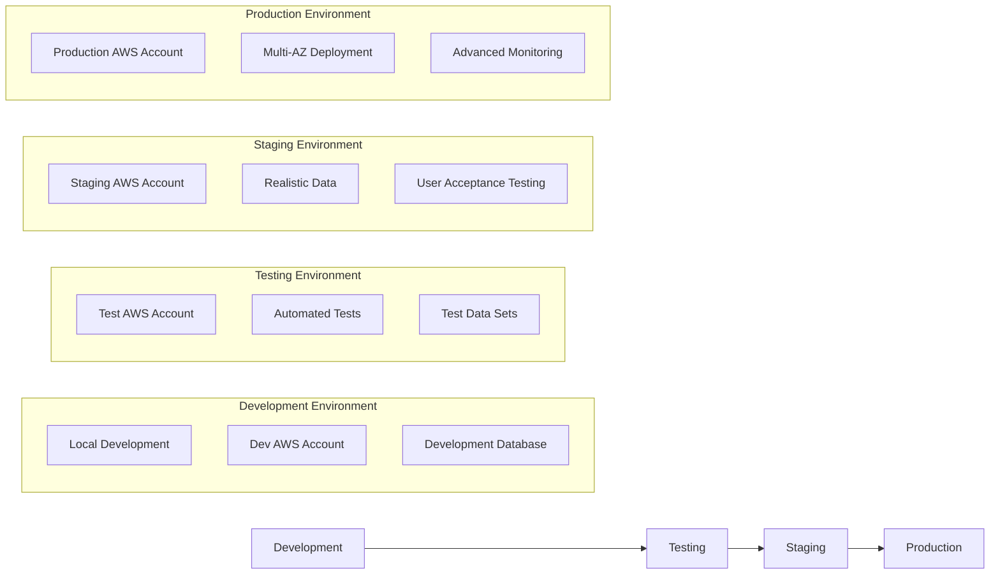
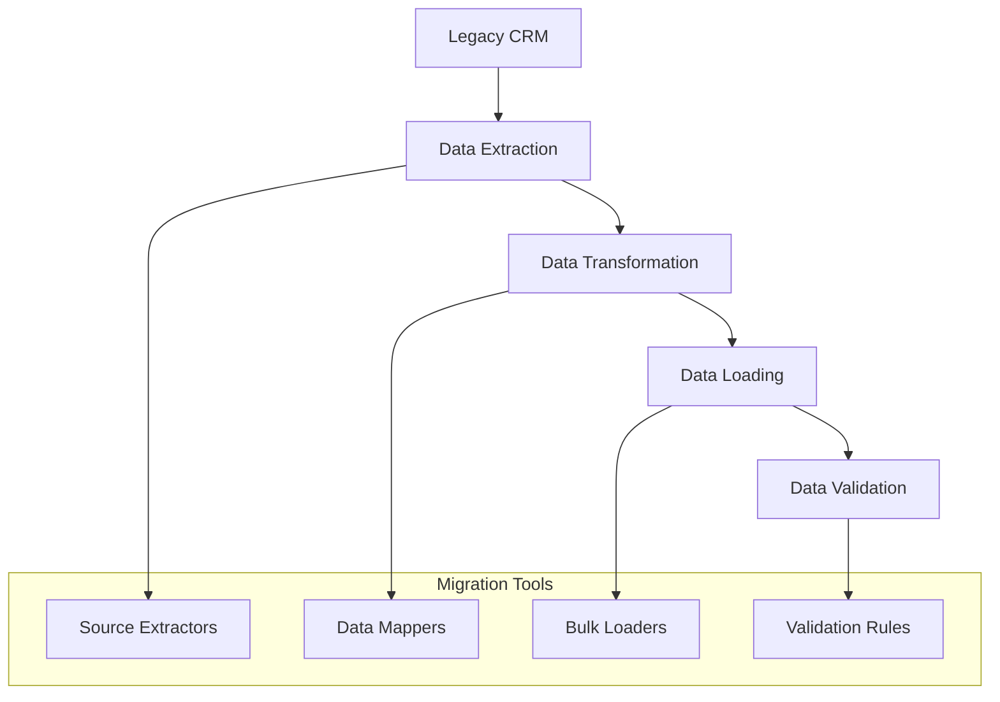
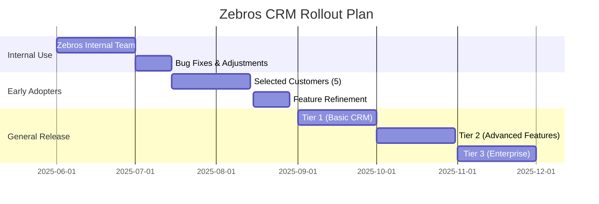

# Zebros CRM Implementation Plan

This document outlines the phased implementation approach for the Zebros CRM serverless architecture, allowing for incremental development and deployment.

## Phase Overview



## Implementation Sequence

### 1. Foundation Setup



### 2. Core CRM Features



### 3. CRM Reporting & Analytics Implementation



### 4. Advanced CRM Features



## Technology Stack for Zebros CRM

```mermaid
flowchart TD
    Stack[Technology Stack] --> Backend[Backend]
    Stack --> Frontend[Frontend]
    Stack --> DevOps[DevOps & Tooling]
    
    Backend --> AWS[AWS Services]
    Backend --> Languages[Programming Languages]
    Backend --> Frameworks[Frameworks]
    
    AWS --> Core[Core Services]
    AWS --> Compute[Compute Services]
    AWS --> Storage[Storage Services]
    AWS --> Security[Security Services]
    
    Core --> APIGW[API Gateway]
    Core --> CloudFront[CloudFront]
    Core --> Route53[Route53]
    
    Compute --> Lambda[Lambda]
    Compute --> Fargate[Fargate]
    Compute --> StepF[Step Functions]
    
    Storage --> S3[S3]
    Storage --> DynamoDB[DynamoDB]
    Storage --> Aurora[Aurora Serverless]
    
    Security --> IAM[IAM]
    Security --> KMS[KMS]
    Security --> WAF[WAF]
    
    Languages --> Node[Node.js]
    Languages --> Python[Python]
    Languages --> TypeScript[TypeScript]
    
    Frameworks --> ServerlessF[Serverless Framework]
    Frameworks --> CDK[AWS CDK]
    Frameworks --> Express[Express.js]
    
    Frontend --> React[React]
    Frontend --> Redux[Redux]
    Frontend --> MaterialUI[Material UI]
    Frontend --> ReactNative[React Native (Mobile)]
    
    DevOps --> CI[CI/CD Pipeline]
    DevOps --> Monitoring[Monitoring Stack]
    DevOps --> IaC[Infrastructure as Code]
```

## Zebros CRM-Specific Milestones and Deliverables

| Phase | Milestone | Key Deliverables |
|-------|-----------|-----------------|
| 1 | Foundation | - Terraform/CDK infrastructure code<br>- Keycloak with Zebros branding<br>- API Gateway structure<br>- CI/CD pipeline |
| 2 | Core CRM | - Customer/Contact management<br>- Opportunity tracking<br>- Activity management<br>- Basic CRM web interface |
| 3 | Reporting | - Sales performance reports<br>- Activity tracking reports<br>- Custom report builder<br>- Dashboard functionality |
| 4 | Advanced Features | - Sales pipeline visualization<br>- Real-time activity notifications<br>- Email integration<br>- Mobile app access |

## Team Structure



## Testing Strategy



## Initial Development Environment



## Data Migration Strategy

For customers migrating from existing CRM systems:



## Rollout Plan

