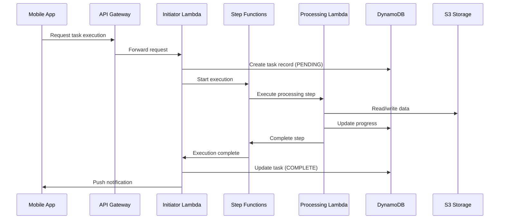
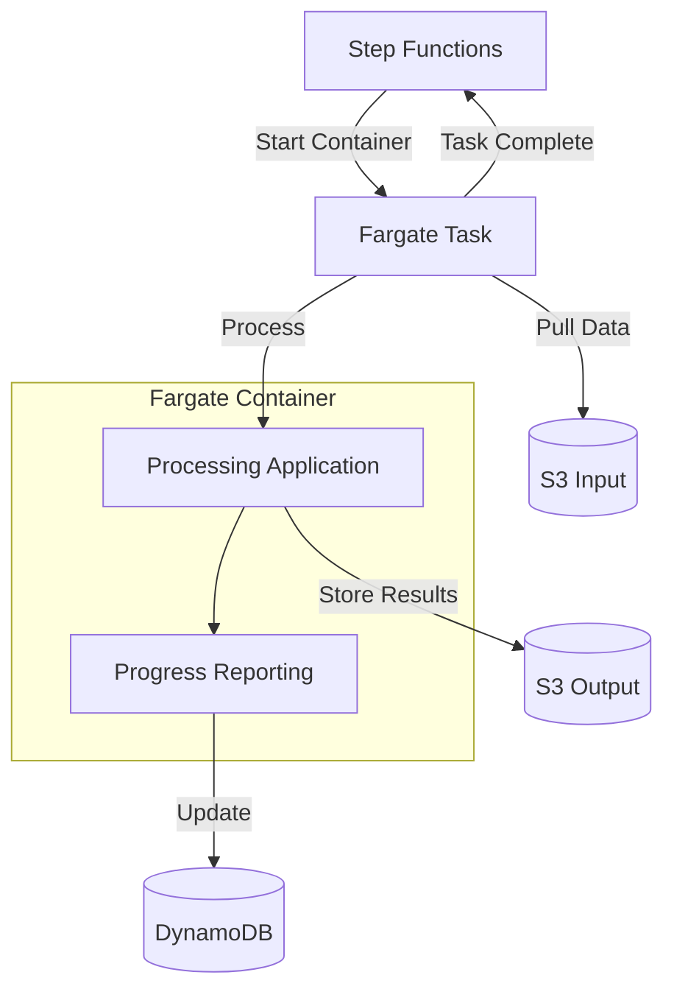
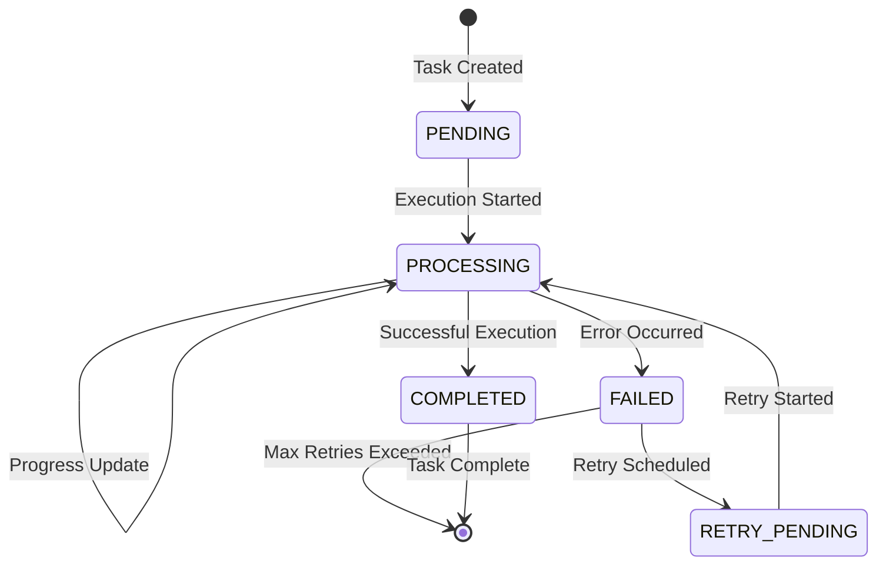

# Long-Running Tasks Architecture

This document outlines the architecture for handling long-running tasks that process large data volumes.

## Overview

Long-running tasks are implemented using a combination of AWS Step Functions for orchestration and AWS Fargate for processing, with Lambda functions for coordination.

## Task Types and Processing

The system supports different processing patterns based on task requirements:

### Lambda-Based Processing

For smaller workloads that can complete within Lambda's execution limits:

### Fargate-Based Processing

For larger workloads that require more memory, CPU, or time than Lambda provides:

## Task Status Tracking

Each task's status is tracked in DynamoDB with the following flow:

## Scaling Considerations

- **Fargate Tasks**: Initially configured with minimal resources
  - CPU: 0.25 vCPU
  - Memory: 0.5 GB 
  - Scale up to 4 vCPU and 8 GB for larger tasks

- **Concurrency**:
  - Initial concurrent task limit: 5
  - Configurable limits per user/tenant
  - Queue mechanism for exceeding concurrency limits

- **Data Handling**:
  - Streaming patterns for large datasets
  - Checkpointing for resumable operations
  - Efficient storage patterns (Parquet, compression)

## Monitoring and Observability

- CloudWatch Logs for all container output
- Custom metrics for task progress
- X-Ray for tracing across components
- Alerting on stuck or failed tasks