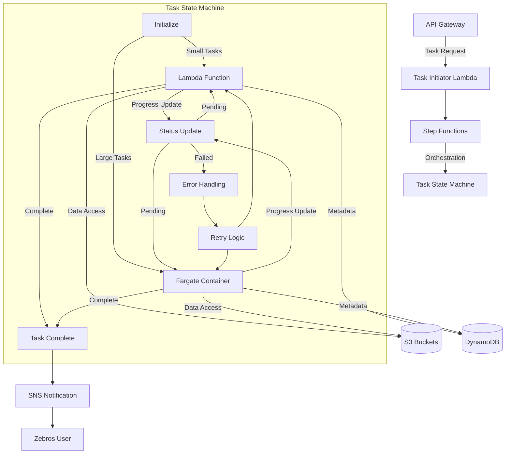
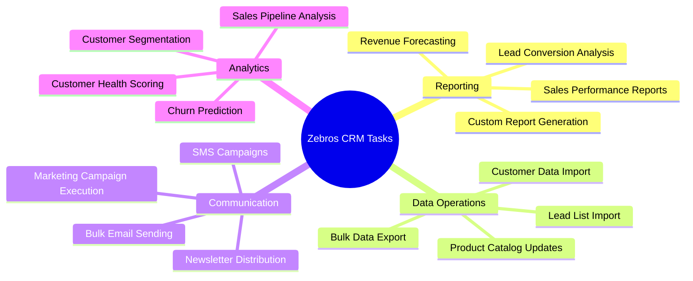
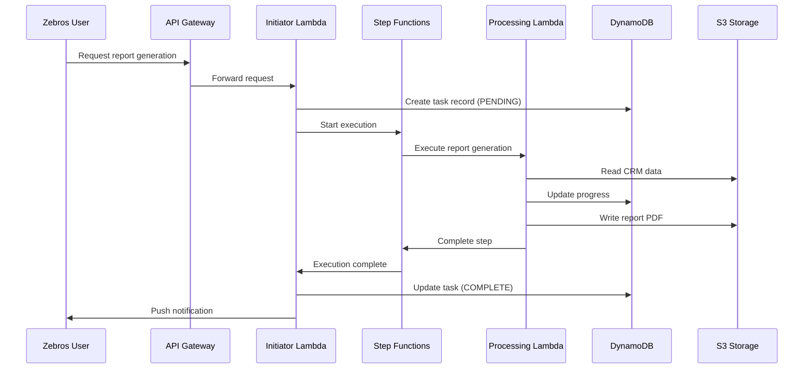
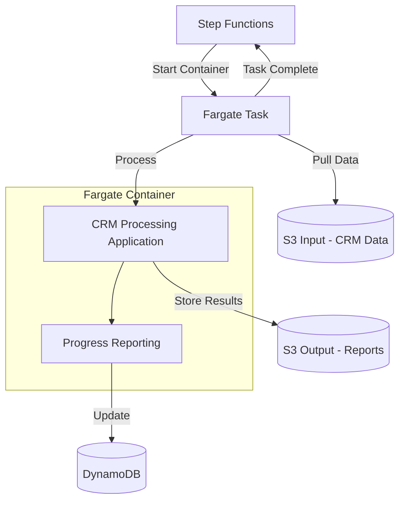
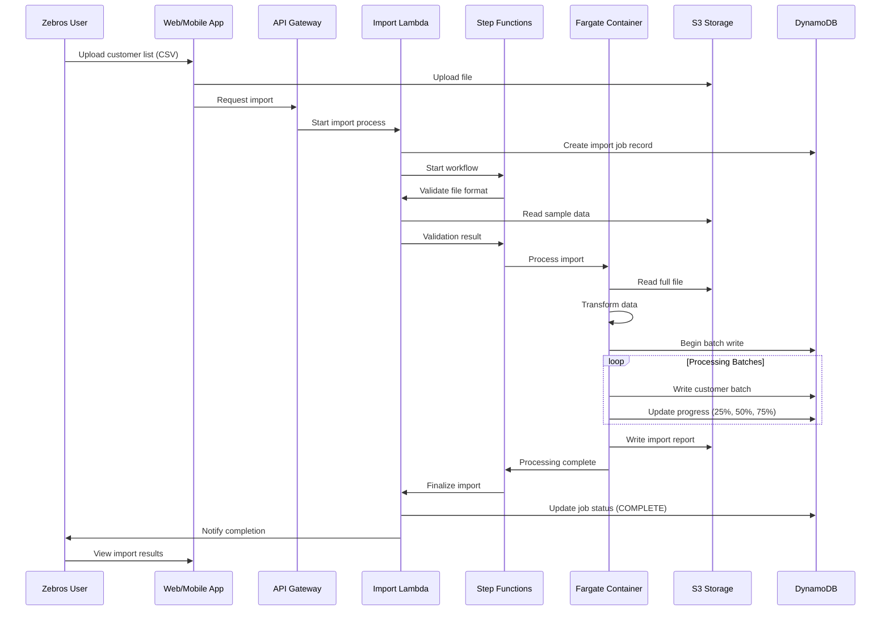
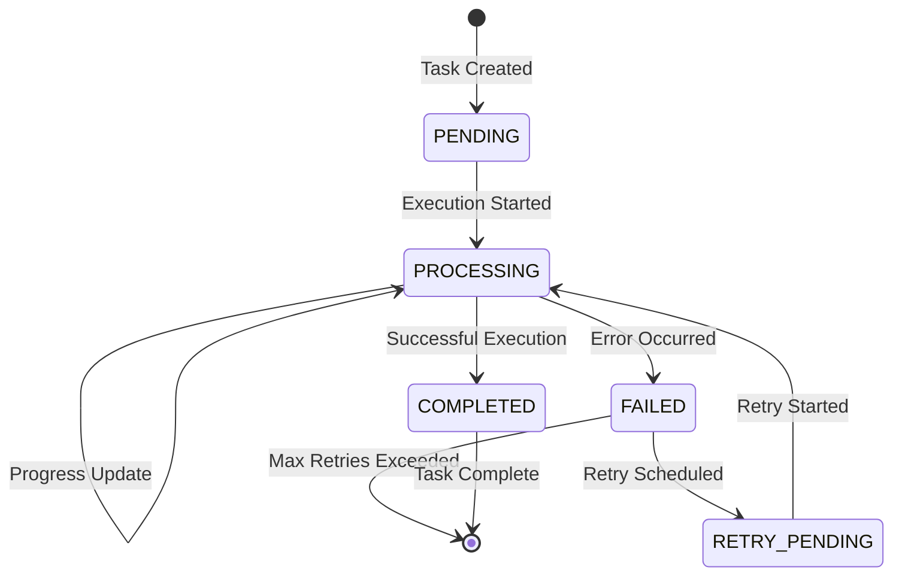
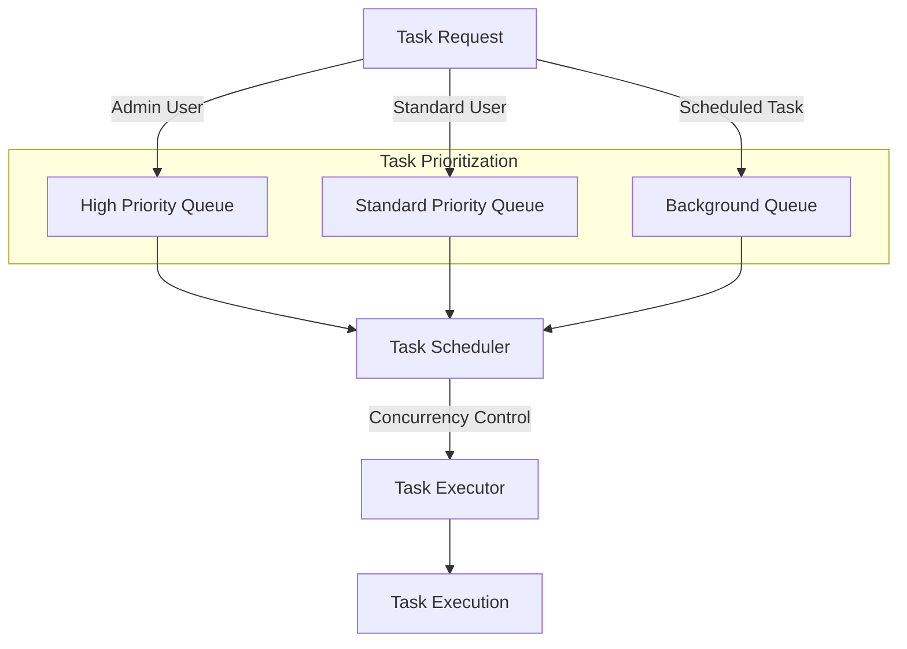
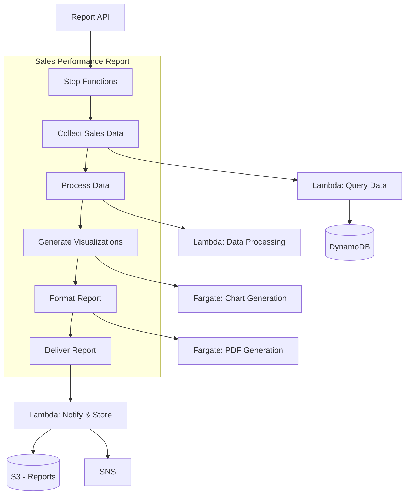

# Zebros CRM Long-Running Tasks Architecture

This document outlines the architecture for handling long-running tasks in the Zebros CRM system, including report generation, data imports, and analytics processes.

## Overview

Long-running tasks are implemented using a combination of AWS Step Functions for orchestration and AWS Fargate for processing, with Lambda functions for coordination.

## CRM-Specific Long-Running Tasks

The Zebros CRM system includes several types of long-running tasks:

## Task Types and Processing

The system supports different processing patterns based on task requirements:

### Lambda-Based Processing

For smaller CRM workloads that can complete within Lambda's execution limits:

### Fargate-Based Processing

For larger CRM workloads that require more memory, CPU, or time than Lambda provides:

## Example: Bulk Customer Import

## Task Status Tracking

Each task's status is tracked in DynamoDB with the following flow:

## Task Queue Management

For managing multiple CRM tasks requested by different users:

## Example CRM Reports Implementation

## Scaling Considerations

- **Fargate Tasks**: Initially configured with minimal resources
  - CPU: 0.25 vCPU for basic reports
  - Memory: 0.5 GB for standard data processing
  - Scale up to 4 vCPU and 8 GB for large data imports/exports

- **Concurrency**:
  - Initial concurrent task limit: 5 per tenant
  - Premium tier: 20 concurrent tasks
  - Queue mechanism for exceeding concurrency limits

- **Data Handling**:
  - Streaming patterns for large customer datasets
  - Checkpointing for resumable operations
  - Progressive loading for large reports

## Monitoring and Observability

- CloudWatch Logs for all container output
- Custom metrics for CRM task progress
- X-Ray for tracing across components
- Alerting on stuck or failed tasks
- Task history retention for auditing and debugging