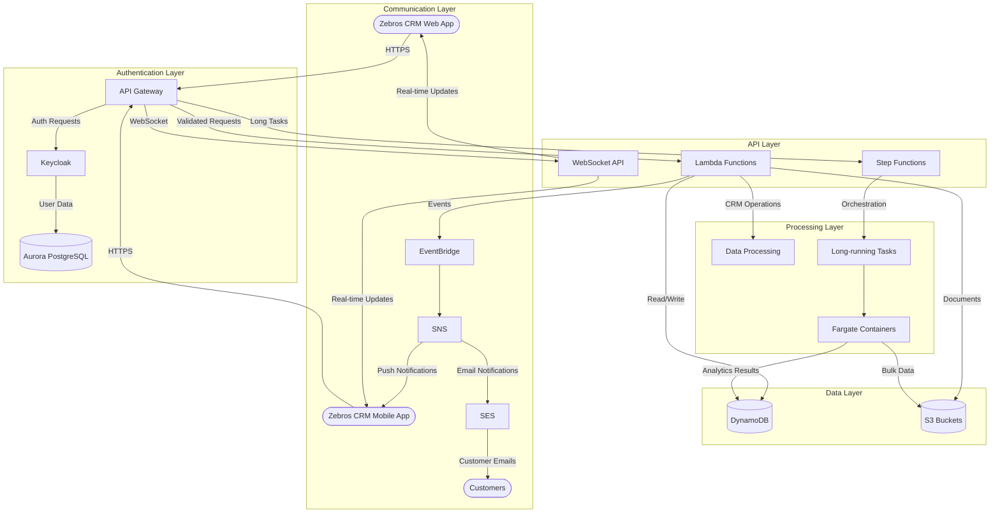
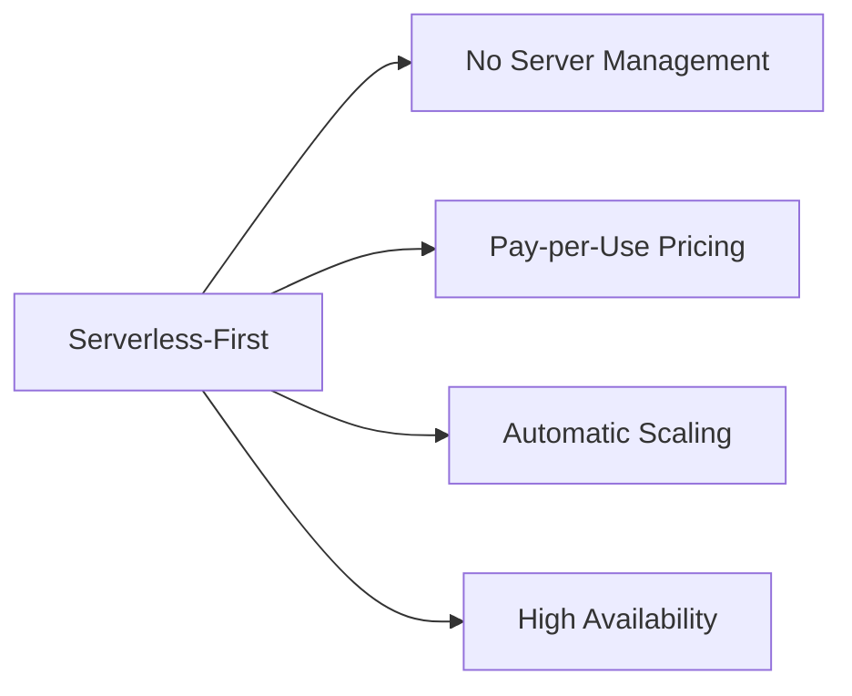
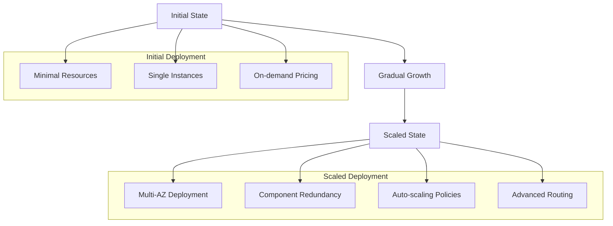
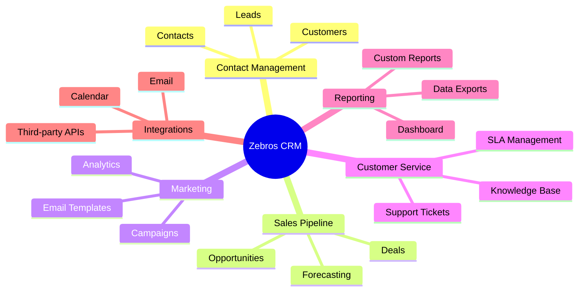
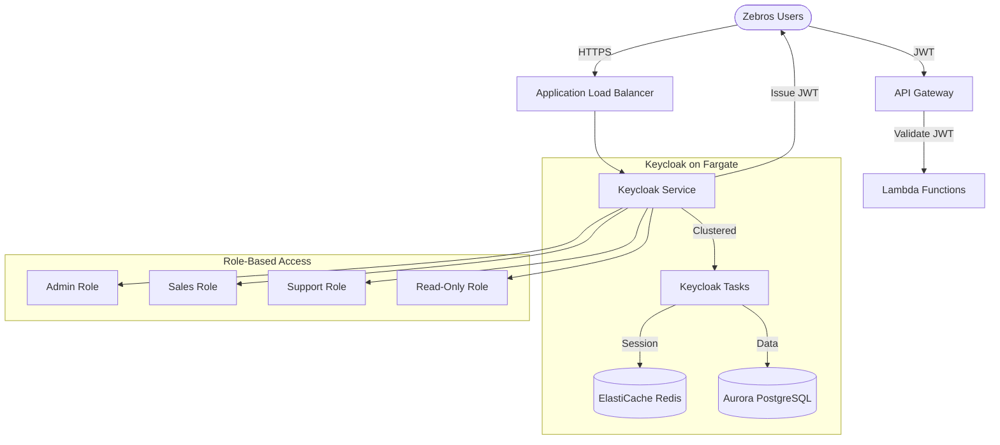
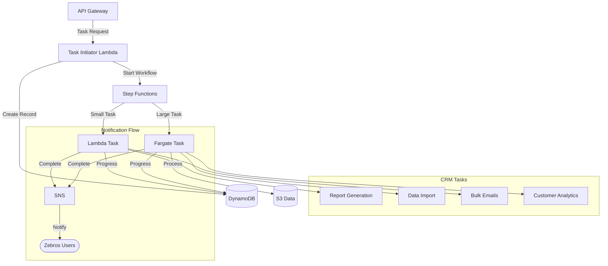
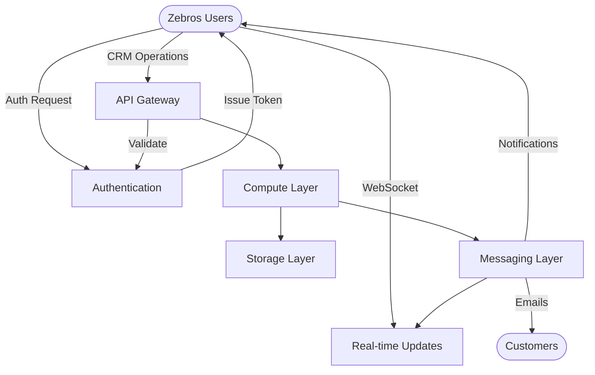
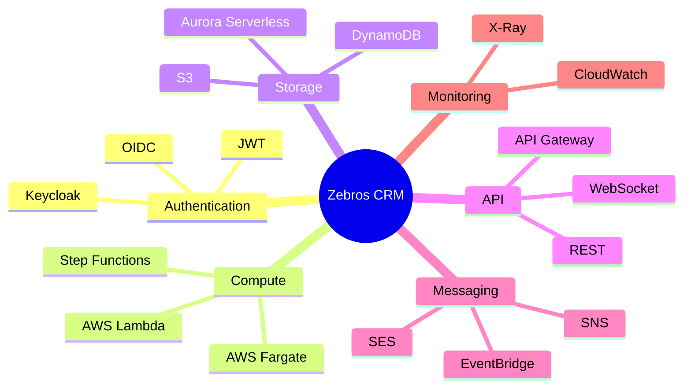
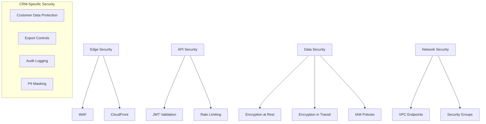
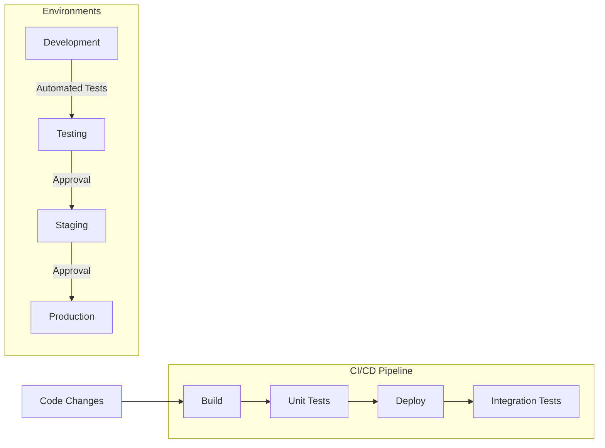

# Zebros CRM - Serverless Architecture Overview

This document provides a comprehensive overview of the serverless architecture for the Zebros CRM system.

## High-Level Architecture

## Key Design Principles

### 1. Serverless-First Approach

The architecture adopts a serverless-first approach to minimize operational overhead and infrastructure management:

### 2. Small Start, Big Scale

Designed to start with minimal resources but scale to handle growth:

### 3. CRM-Specific Features

### 4. Authentication Architecture

### 5. Long-Running Task Architecture

## Component Integration

The following diagram shows how the various components of the architecture integrate:

## Technology Choices

## Security Architecture

## Deployment and Staging

## For Further Details

Please refer to the detailed architecture documents:

1. [Authentication Flow](./auth.md)
2. [API Services](./api.md)
3. [Long-running Tasks](./long-running.md)
4. [Data Storage](./data.md)
5. [Scaling Plan](./scaling.md)
6. [Implementation Plan](./implementation-plan.md)