# Zebros CRM Scaling Strategy

This document outlines the scaling strategy for the Zebros CRM serverless architecture, ensuring it can grow from a minimal initial deployment to a full-scale enterprise CRM system.

## Initial Deployment (Minimum Viable CRM)

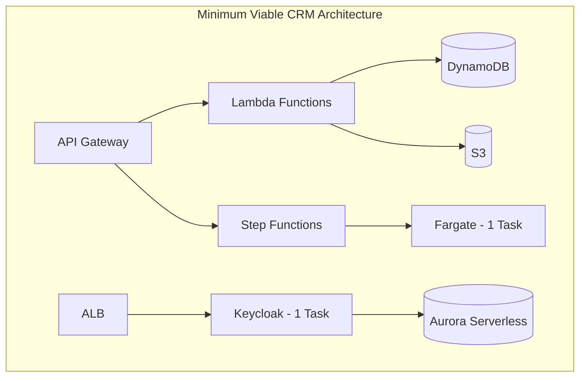

Initial sizing:
- Lambda: 128MB, 100 concurrent executions
- Fargate: 0.25 vCPU, 0.5GB memory
- DynamoDB: On-demand capacity
- API Gateway: Default quotas
- Aurora Serverless: 1 ACU min, 2 ACU max

## Scaling Dimensions for Zebros CRM

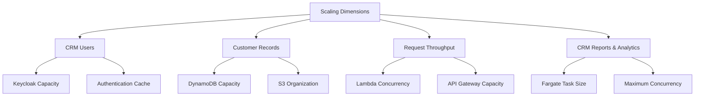

## CRM Usage Tiers and Scaling

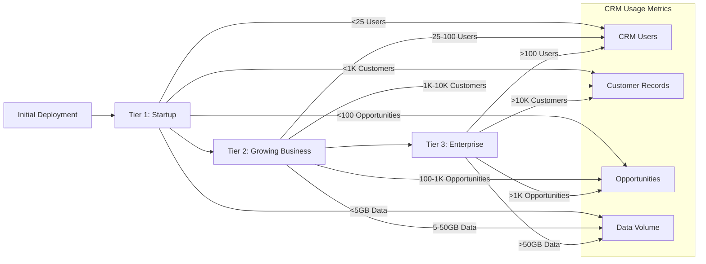

## Phased Scaling Approach

### Phase 1: Startup CRM (25 Users)

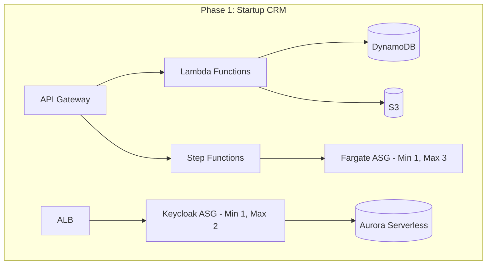

- Lambda: 256MB, 200 concurrent executions
- Fargate: Auto-scaling 1-3 tasks
- DynamoDB: Begin provisioned capacity with auto-scaling
- Aurora: 2 ACU min, 4 ACU max

### Phase 2: Growing Business CRM (100 Users)

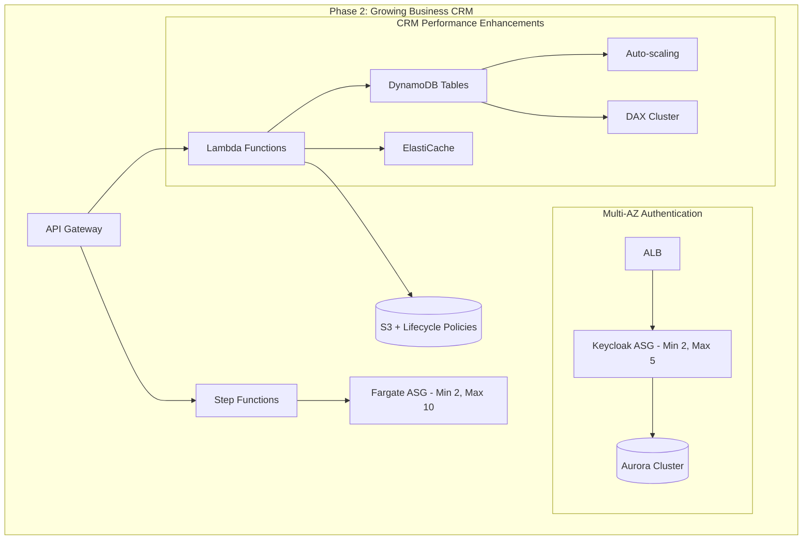

- Lambda: 512MB-1GB depending on function
- Fargate: Auto-scaling 2-10 tasks across AZs
- DynamoDB: Add DAX cluster for caching
- API Gateway: Custom domain, WAF protection
- Aurora: Multi-AZ cluster
- ElastiCache: 2-node cluster for session caching

### Phase 3: Enterprise CRM (250+ Users)

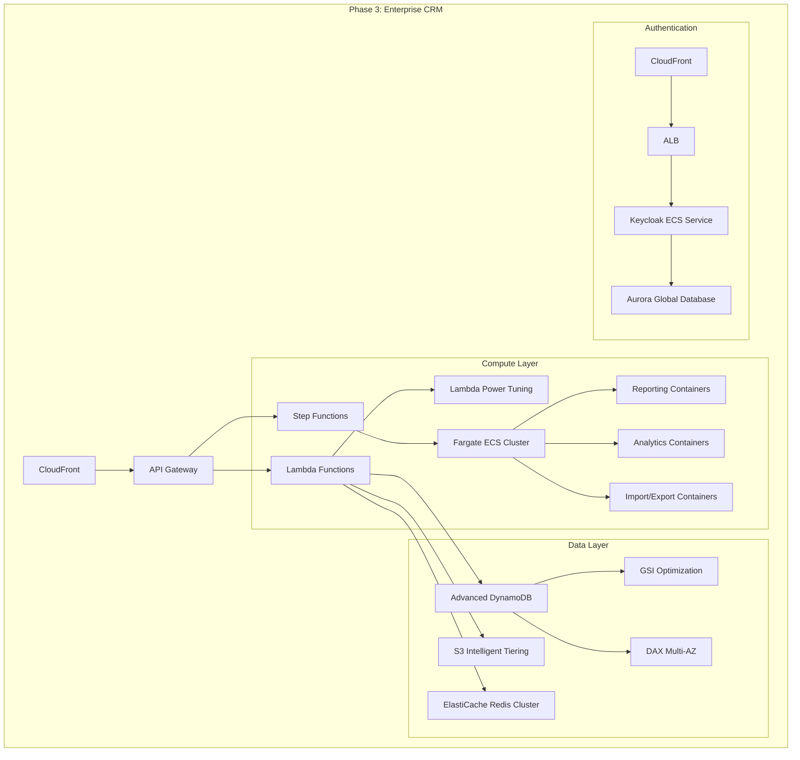

## Auto-Scaling Configurations for CRM Workloads

### Lambda Scaling for CRM Operations

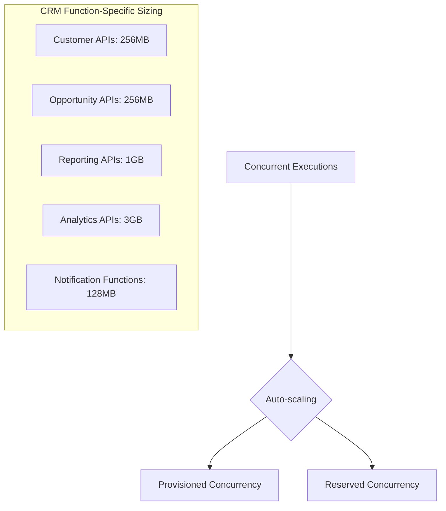

### Fargate Scaling for CRM Tasks

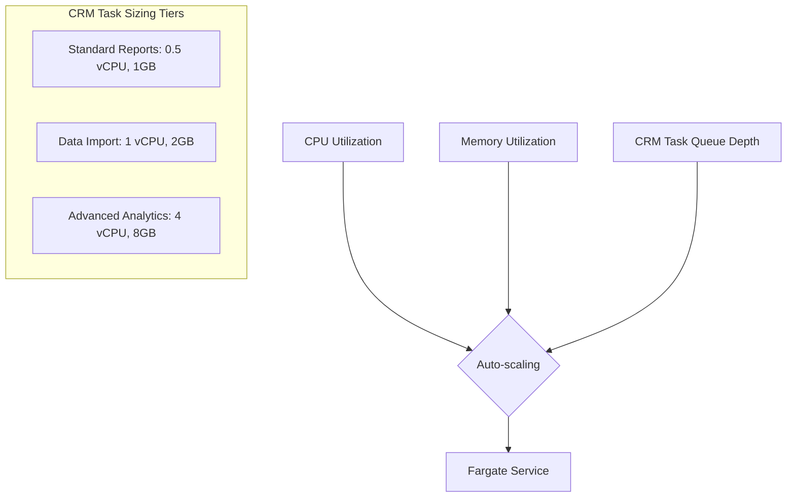

### DynamoDB Scaling for CRM Data

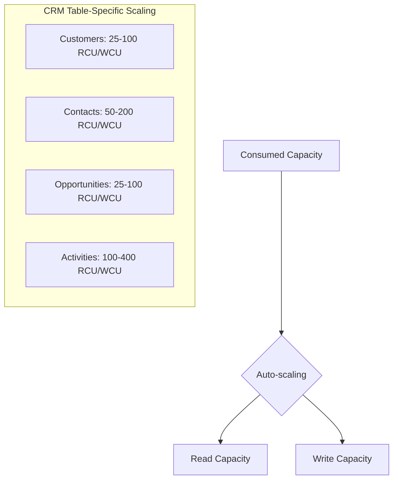

## Cost Optimization Strategies for Zebros CRM

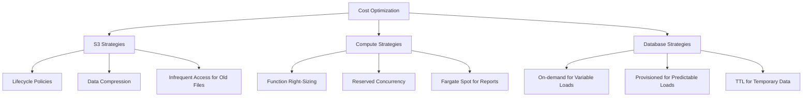

## CRM-Specific Scaling Triggers and Thresholds

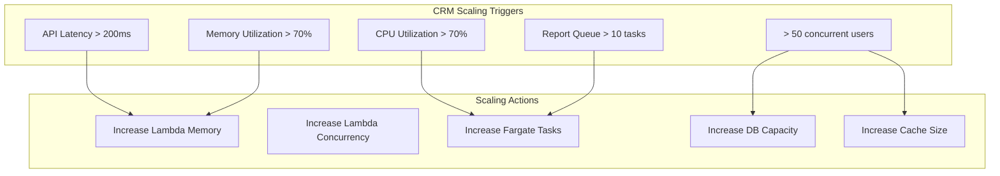

## Multi-Region Strategy for Global CRM Deployment

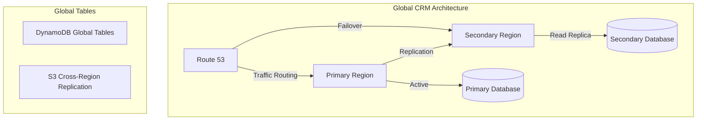

## Monitoring for Zebros CRM Scale

Key metrics for monitoring CRM scaling needs:

- Per-endpoint latency (p95, p99)
- Concurrent Lambda executions by function type
- DynamoDB consumed capacity by entity type (customers, contacts, opportunities)
- Step Function execution time for report generation
- Fargate CPU/memory utilization during peak hours
- API Gateway request count by business hours
- Active user sessions per hour
- Report generation queue depth
- File storage growth rate
- Cache hit/miss ratios