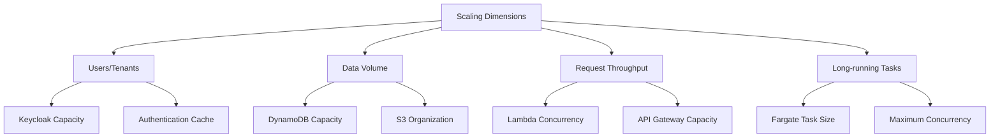
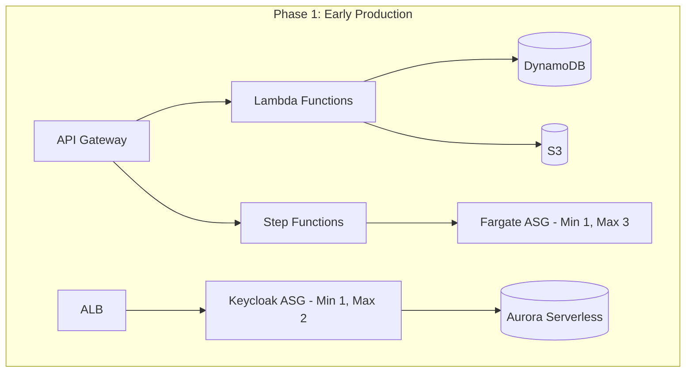
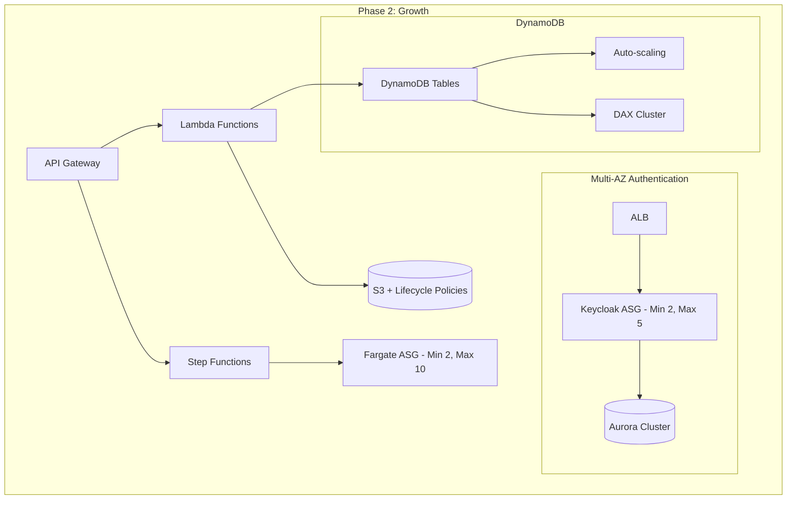
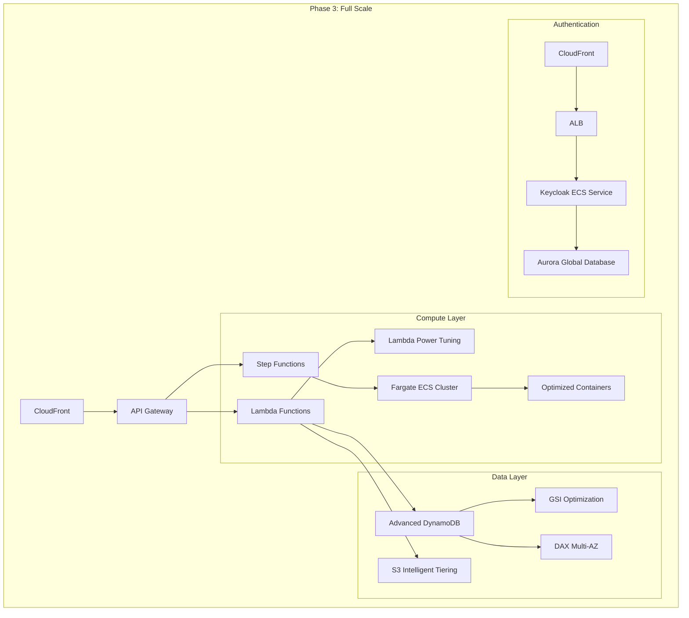
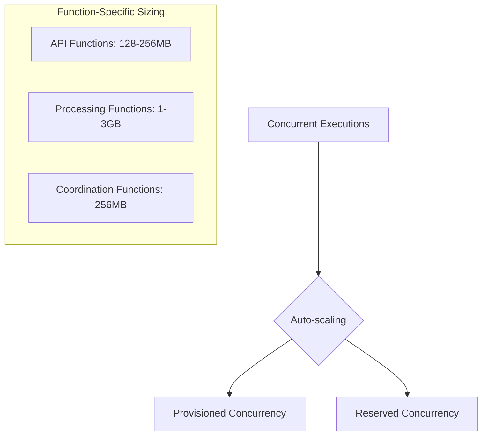
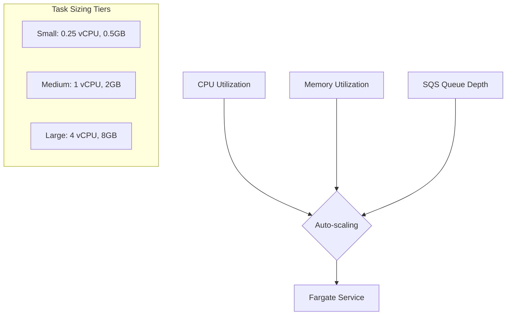
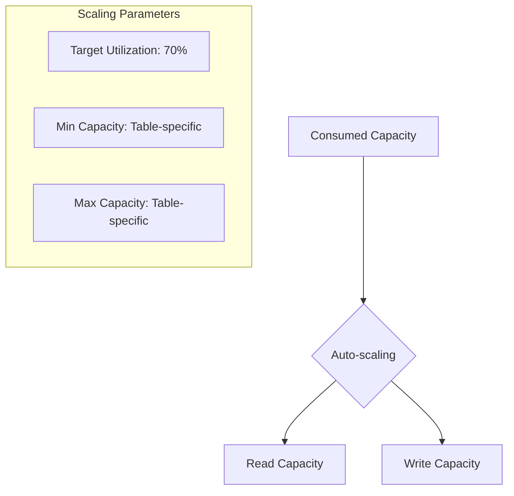
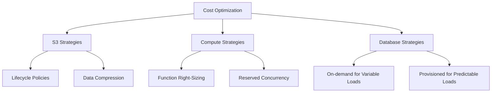
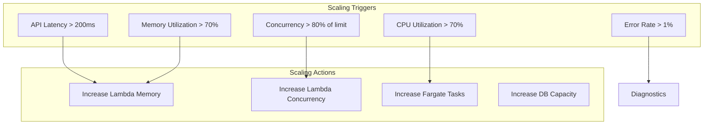

# Scaling Strategy

This document outlines the scaling strategy for the serverless architecture, ensuring it can grow from a minimal initial deployment to a full-scale production system.

## Initial Deployment (Minimum Viable Architecture)

Initial sizing:
- Lambda: 128MB, 100 concurrent executions
- Fargate: 0.25 vCPU, 0.5GB memory
- DynamoDB: On-demand capacity
- API Gateway: Default quotas
- Aurora Serverless: 1 ACU min, 2 ACU max

## Scaling Dimensions

## Phased Scaling Approach

### Phase 1: Early Production (1K Users)

- Lambda: 256MB, 200 concurrent executions
- Fargate: Auto-scaling 1-3 tasks
- DynamoDB: Begin provisioned capacity with auto-scaling
- Aurora: 2 ACU min, 4 ACU max

### Phase 2: Growth (10K Users)

- Lambda: 512MB-1GB depending on function
- Fargate: Auto-scaling 2-10 tasks across AZs
- DynamoDB: Add DAX cluster for caching
- API Gateway: Custom domain, WAF protection
- Aurora: Multi-AZ cluster

### Phase 3: Scale (100K+ Users)

## Auto-Scaling Configurations

### Lambda Scaling

### Fargate Scaling

### DynamoDB Scaling

## Cost Optimization Strategies

## Scaling Triggers and Thresholds

## Monitoring for Scale

Key metrics for monitoring scaling needs:

- Per-endpoint latency (p95, p99)
- Concurrent Lambda executions
- DynamoDB consumed capacity
- Step Function execution time
- Fargate CPU/memory utilization
- API Gateway request count
- API Gateway integration latency