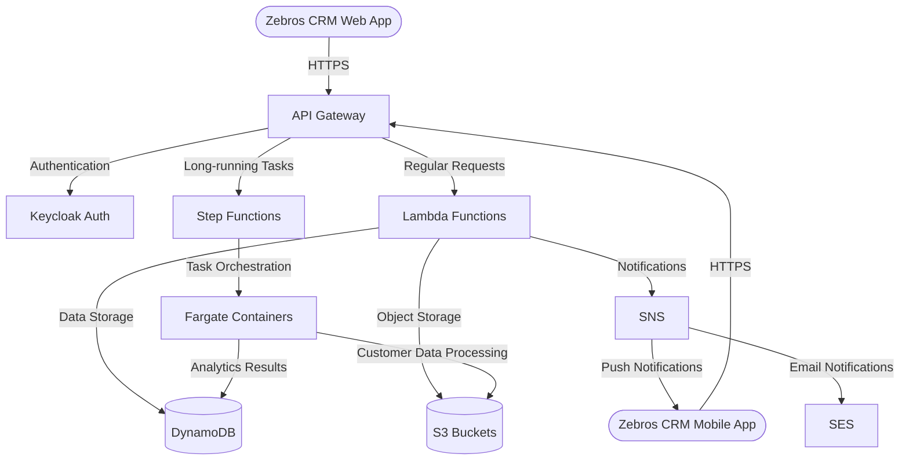

# Zebros CRM - Serverless Architecture

This document outlines a serverless architecture for Zebros CRM, a customer relationship management system that supports authenticated users and long-running tasks with large data volumes.

## Overview

The architecture follows a serverless approach using AWS services, with authentication provided by Keycloak running in a serverless container.

## Key Components

- **API Gateway**: Entry point for all web and mobile app requests
- **Lambda Functions**: Handle regular CRM operations (contacts, opportunities, etc.)
- **Step Functions**: Orchestrate complex, long-running workflows (report generation, data imports)
- **Fargate**: Run containerized tasks that need more memory/CPU (analytics, batch processing)
- **DynamoDB**: NoSQL database for CRM entities (customers, leads, opportunities)
- **S3**: Object storage for documents, attachments, and bulk data
- **SNS**: Notification service for real-time updates to users
- **SES**: Email service for customer communications
- **Keycloak**: Authentication service running in a Fargate container

See the architecture directory for detailed design documents:

1. [Authentication Flow](./architecture/auth.md)
2. [API Services](./architecture/api.md)
3. [Long-running Tasks](./architecture/long-running.md)
4. [Data Storage](./architecture/data.md)
5. [Scaling Plan](./architecture/scaling.md)